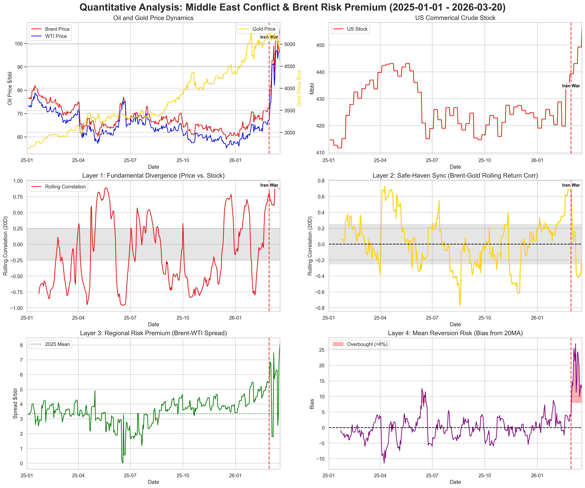

# 🚀Quantitative Analysis: Crude Oil "Risk Premium" Under Middle East Conflict
## 中东冲突背景下的原油“风险溢价”量化分析报告

[](https://www.python.org/)
[](LICENSE)

### 1. Project Overview (项目概览)
This project focuses on quantifying the **geopolitical risk premium** embedded in global crude oil prices, specifically during the 2026 Middle East tensions. By integrating heterogeneous data sources, the project provides a systematic approach to isolating risk-driven price dislocations from market fundamentals.

本项目旨在量化 2026 年中东局势紧张期间全球原油价格中的**地缘政治风险溢价**。通过整合多源异质数据，本项目提供了一种系统化的方法，将风险驱动的价格错位从市场基本面中分离出来。

---

### 2. Key Analytical Dimensions (核心分析维度)
To provide a comprehensive market view, the analysis is structured into four integrated layers:
为了提供全面的市场视角，分析分为四个核心层级：

* **Layer 1 1: Price-Inventory Divergence (库存与价格背离)** Analyzes whether price surges are supported by physical draws or driven by speculative fear.  
    分析价格上涨是由实际库存去化支撑，还是由投机性恐慌驱动。
* **Layer 2: Sentiment Logic (情绪面逻辑：油金联动)** Monitors the correlation between Crude Oil and Gold (Safe-haven assets) to gauge global risk aversion.  
    监测原油与黄金（避险资产）的联动性，以衡量全球避险情绪的强度。
* **Layer 3: Arbitrage Spread (套利价差趋势)** Tracks the Brent-WTI spread to identify regional supply bottlenecks and logistics risk.  
    追踪 Brent-WTI 价差变化趋势，识别地区性供应瓶颈与物流风险。
* **Layer 4: Technical Indicators (波动率与乖离率)** Uses volatility clusters and Bias Ratio to measure market panic and overbought/oversold conditions.  
    利用波动率聚集和乖离率测量市场恐慌度，识别超买/超卖信号

---

### 3. Visual Outcome (可视化成果)
The project culminates in a **Four-Tier Quantitative Dashboard**.
项目最终生成了一个**四层量化全景看板**。



---

### 4. Tech Stack (技术栈)
- **Data Processing:** `Pandas`, `NumPy` (Time-series alignment and cleansing)
- **Visualization:** `Matplotlib`, `Seaborn` (Advanced multi-axis plotting)
- **Data Sourcing:** `Excel/CSV` (Historical futures and inventory data)

---

### 5. Repository Structure (目录架构)
```text
├── Data/                # Raw datasets (Brent/WTI/Gold/EIA Inventory)
├── Notebooks/           # Jupyter Notebooks with detailed analysis
├── Output/              # Exported visualizations (PNG/PDF)
├── requirements.txt     # Environment dependencies
└── README.md            # Project documentation

